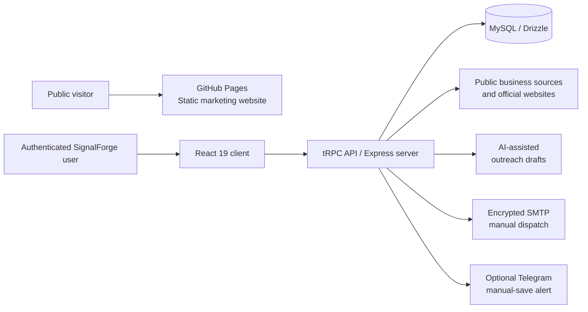

# SignalForge

<p align="center">
  
</p>

<p align="center"><strong>Approval-first B2B prospecting for thoughtful, accountable outreach.</strong></p>

<p align="center">
  <a href="https://nourti.github.io/-signalforge/"><strong>Visit the public site</strong></a> ·
  <a href="./signalforge-fullstack-source.zip"><strong>Download the full application source</strong></a>
</p>

<p align="center">
  
  
  
  
  
</p>

## The project, clearly

SignalForge is **not just an HTML landing page**. It is a full-stack B2B prospecting workspace designed to help a user find public businesses, research them, build a private lead pipeline, create outreach drafts, and send only after deliberate human review and confirmation.

This repository has two layers. The files at repository root are the public GitHub Pages marketing site. The complete application source is published in **[signalforge-fullstack-source.zip](./signalforge-fullstack-source.zip)** and includes the React client, TypeScript/Express server, tRPC API contracts, Drizzle/MySQL schema, encrypted SMTP services, compliance controls, and automated tests.

> GitHub Pages can host the public website, but it cannot run a Node.js server, database, encrypted credentials, SMTP, or authenticated workflows. This is a hosting boundary, not an absence of backend code.

## What SignalForge does

| Area | Capability |
| --- | --- |
| Public-business discovery | Finds businesses from a user-controlled keyword, industry, business-type, city, country, and mode query. |
| Visible-email research | Scans official websites for visible business email addresses only and preserves research provenance. |
| Lead workspace | Supports lead records, statuses, notes, activity history, analytics, and CSV export. |
| Outreach drafting | Uses AI to prepare reviewable outreach drafts from user-provided context. |
| Human approval | Requires draft review, sender validation, explicit approval, and final confirmation before dispatch. |
| Email operations | Stores SMTP settings encrypted at rest and records delivery or failure activity. |
| Compliance controls | Includes sender profiles, recipient suppression, signed opt-out links, daily limits, readiness checks, and policy pages. |
| Optional alerts | Supports encrypted Telegram settings for manual-save notifications. |

## Full-stack architecture



| Layer | Technology | Responsibility |
| --- | --- | --- |
| Public presence | HTML, CSS, GitHub Pages | Product narrative, brand assets, social metadata, and beta contact route. |
| Product frontend | React 19, TypeScript, Tailwind 4, Wouter | Authenticated dashboard for discovery, leads, outreach, compliance, settings, and product guidance. |
| Product backend | Node.js, Express 4, tRPC 11, Zod | Typed API, workflow guards, discovery, encryption, sender policy, and email-dispatch decisions. |
| Data model | Drizzle ORM and MySQL | Leads, activity, drafts, policies, suppression, sender profiles, and encrypted integration settings. |
| Quality | Vitest | Eighteen automated checks covering lead workflows, discovery, suppression, opt-out, sender readiness, and send guards. |

## The complete source package

Download **[signalforge-fullstack-source.zip](./signalforge-fullstack-source.zip)** to access the product source. It contains more than 125 TypeScript/TSX source files, SQL schema migrations, configuration, tests, and documentation — not compiled output and not private credentials.

| Package path | What it contains |
| --- | --- |
| `app/client/` | React user interface, pages, design components, routing, and styles. |
| `app/server/` | Express/tRPC API, discovery, email, crypto, compliance, Telegram, and database services. |
| `app/drizzle/` | MySQL schema, snapshots, and migration history. |
| `app/shared/` | Shared typed contracts and constants. |
| `app/server/*.test.ts` | Vitest regression suite. |
| `app/ENVIRONMENT.md` | Required configuration variables without publishing a single real credential. |
| `docs/` | Product guide and deployment architecture documentation. |

The source package excludes `node_modules`, logs, local environment files, database URLs, SMTP passwords, private API tokens, and platform-owned production configuration.

## How a user works with SignalForge

1. **Discover:** define the business type and location you want to research.
2. **Review:** inspect public data and visible emails found only on official business websites.
3. **Qualify:** save the company to a private pipeline and add notes or research context.
4. **Draft:** create a tailored outreach draft rather than sending a message automatically.
5. **Approve:** verify sender identity, suppression state, policy rules, and draft quality.
6. **Confirm:** deliberately confirm the exact message before it is sent through the configured SMTP account.

The product is deliberately not a bulk-spam machine. Suppressed recipients, opt-outs, incomplete sender identity, daily-limit breaches, and failed sender-readiness checks block drafting or dispatch as appropriate.

## Run the full application

The published GitHub Pages site is static. To work with the application source, download and extract the source package, then use Node.js 22+ and pnpm 10+:

```bash
git clone https://github.com/NourTi/-signalforge.git
cd -signalforge
unzip signalforge-fullstack-source.zip
cd app
pnpm install
pnpm db:push
pnpm dev
```

Provision a MySQL-compatible database and configure the variables listed in `app/ENVIRONMENT.md` with a private local environment file or a deployment secret manager. Never commit SMTP passwords, database URLs, authentication secrets, or API keys.

The source contains platform adapter boundaries under `app/server/_core/` for authentication, storage, maps, LLM access, and owner notifications. To deploy outside the original environment, connect these adapters to your chosen providers, keep secrets in the host's secret manager, and deploy the Node.js application server.

## Public site and documentation

The public marketing site is live at **[nourti.github.io/-signalforge](https://nourti.github.io/-signalforge/)**. It is intentionally separate from the application runtime and does not expose the secure application deployment or user data.

For contribution and responsible disclosure details, see [CONTRIBUTING.md](./CONTRIBUTING.md) and [SECURITY.md](./SECURITY.md).

## License

This project is provided under the [MIT License](./LICENSE).
