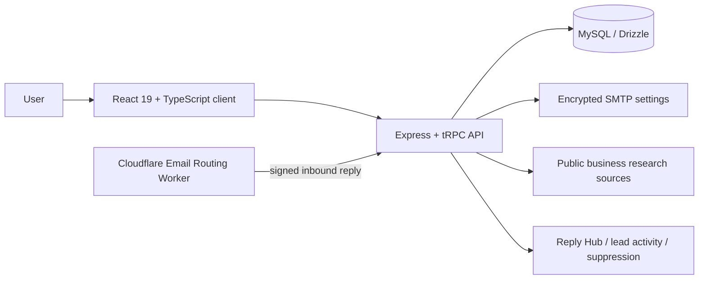

# SignalForge

<p align="center">
  
</p>

<p align="center"><strong>Open-source, approval-first B2B prospecting for thoughtful and accountable outreach.</strong></p>

<p align="center">
  <a href="https://nourti.github.io/-signalforge/"><strong>Public site</strong></a> ·
  <a href="./app/"><strong>Browse application source</strong></a> ·
  <a href="./app/README.md"><strong>Run locally</strong></a> ·
  <a href="./CONTRIBUTING.md"><strong>Contribute</strong></a>
</p>

<p align="center">
  
  
  
  
  
</p>

## Open-source project, not a landing-page shell

This repository contains **the real SignalForge application**, not only a marketing site. Browse the source directly under [`app/`](./app/): the React interface, Express/tRPC backend, Drizzle/MySQL schema and migrations, inbound-reply Worker, encryption and compliance code, tests, configuration, and operational documentation.

The repository root also hosts the static GitHub Pages product site. GitHub Pages can serve that public website, but it cannot run the Node.js API, database, encrypted configuration, or authenticated workflows required by the application.

## What SignalForge does

| Area | Capability |
| --- | --- |
| Discovery | Searches public business sources using user-controlled industry, location, type, and keyword filters. |
| Research | Extracts only visible business email addresses from official websites and preserves provenance. |
| Lead workspace | Stores user-isolated leads, notes, activity history, statuses, analytics, and CSV export. |
| Drafting | Produces reviewable AI-assisted outreach drafts from user-provided context. |
| Dispatch control | Requires review, approval, sender readiness, and explicit final confirmation before SMTP dispatch. |
| Compliance | Enforces sender profiles, recipient suppression, signed opt-outs, daily send limits, and DNS readiness checks. |
| Reply Hub | Ingests signed inbound replies, bounces, opt-outs, and out-of-office events without any automatic response path. |

> **Human control is an architectural rule.** SignalForge does not support automated bulk email, automatic responses, or anonymous temporary sender addresses.

## Browse the source

| Area | Direct path | What a visitor can inspect |
| --- | --- | --- |
| Product UI | [`app/client/`](./app/client/) | React pages, navigation, forms, dashboard, Reply Hub, and design system. |
| Server/API | [`app/server/`](./app/server/) | Express bootstrap, tRPC procedures, lead workflows, SMTP, encryption, discovery, compliance, and inbound Reply Hub logic. |
| Database | [`app/drizzle/`](./app/drizzle/) | MySQL schema, migration SQL, relations, and snapshots. |
| Tests | [`app/server/*.test.ts`](./app/server/) | Vitest coverage for lead rules, discovery, sending safeguards, and Reply Hub signature/idempotency checks. |
| Cloudflare worker | [`app/cloudflare-reply-hub/`](./app/cloudflare-reply-hub/) | Optional Email Routing Worker that signs and forwards inbound messages. |
| Setup | [`app/README.md`](./app/README.md) | Local setup, project map, adapter boundaries, and deployment guidance. |

## Architecture



## Run locally

Use Node.js 22+, pnpm 10+, and a MySQL-compatible database.

```bash
git clone https://github.com/NourTi/-signalforge.git
cd -signalforge/app
pnpm install
pnpm drizzle-kit generate
pnpm test
pnpm dev
```

Read [`app/ENVIRONMENT.md`](./app/ENVIRONMENT.md) before creating a private `.env` file. The adapter boundaries under `app/server/_core/` must be connected to providers you control for a standalone deployment. Do not commit database URLs, SMTP passwords, OAuth keys, API tokens, or Reply Hub signing secrets.

## Repository map

```text
.
├── index.html                 GitHub Pages marketing site
├── README.md                  This open-source project guide
├── CONTRIBUTING.md            Contribution workflow
├── SECURITY.md                Responsible disclosure policy
└── app/                       Complete browsable full-stack product source
    ├── client/                React frontend
    ├── server/                Node/Express/tRPC backend and tests
    ├── drizzle/               MySQL data model and migrations
    ├── cloudflare-reply-hub/  Optional inbound Email Routing Worker
    └── docs/                  Feature and deployment documentation
```

## Contributing and security

Read [CONTRIBUTING.md](./CONTRIBUTING.md) before proposing changes and [SECURITY.md](./SECURITY.md) for vulnerability reporting. This project is available under the [MIT License](./LICENSE).
