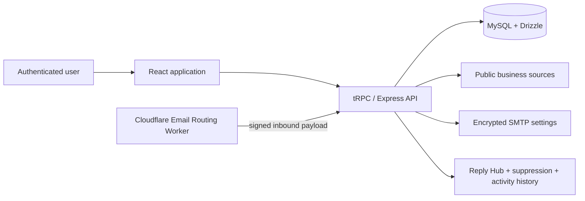

# SignalForge Application

This is the **complete, browsable full-stack source** for SignalForge. It intentionally excludes credentials, customer records, platform-owned service values, local logs, and `node_modules`.

## Stack

| Layer | Technology | Source |
| --- | --- | --- |
| Product interface | React 19, TypeScript, Tailwind CSS 4, Wouter | `client/` |
| Application API | Node.js, Express 4, tRPC 11, Zod | `server/` |
| Database | MySQL-compatible database, Drizzle ORM | `drizzle/` |
| Quality | Vitest | `server/*.test.ts` |
| Reply capture | Cloudflare Email Routing Worker | `cloudflare-reply-hub/` |

## What the code does

SignalForge is an approval-first B2B prospecting workspace. The source includes public business discovery, visible-email extraction from official sites, user-isolated lead records, notes, activity history, AI-assisted outreach drafts, encrypted SMTP settings, recipient suppression, signed unsubscribe routes, sender readiness checks, daily sending limits, and the inbound Reply Hub.

> The product has no automatic outbound email path. A message must be drafted, reviewed, approved, and explicitly confirmed before SMTP dispatch. The Reply Hub stores incoming signals and response drafts only; it cannot send a response.

## Repository map

```text
app/
├── client/                 React screens, components, routes, and design system
├── server/                 API, workflow guards, encryption, discovery, SMTP, Reply Hub
│   ├── _core/              Provider-adapter boundaries for authentication and platform services
│   └── *.test.ts           Vitest coverage for core workflow and compliance behaviour
├── drizzle/                Drizzle schema, relations, snapshots, and SQL migrations
├── shared/                 Shared TypeScript types, constants, and errors
├── cloudflare-reply-hub/   Optional signed Cloudflare Email Routing Worker
├── docs/                   Reply Hub and Cloudflare setup documentation
├── package.json            Application scripts and dependencies
└── ENVIRONMENT.md          Safe configuration inventory; never a real environment file
```

## Run locally

Use **Node.js 22+**, **pnpm 10+**, and a MySQL-compatible database.

```bash
git clone https://github.com/NourTi/-signalforge.git
cd -signalforge/app
pnpm install
pnpm drizzle-kit generate
pnpm test
pnpm dev
```

Create a private `.env` file from the descriptions in [`ENVIRONMENT.md`](./ENVIRONMENT.md). Do not commit it. Apply the reviewed migrations to your development database before using data-backed workflows.

## Architecture



The original project provides provider adapters under `server/_core/` for authentication, maps, storage, notifications, and language-model calls. To host it independently, connect those adapter boundaries to providers you control and keep all secrets in your deployment platform’s secret manager.

## Reply Hub

The optional `cloudflare-reply-hub/` package forwards inbound mail from a domain you own to SignalForge as a signed, idempotent payload. It creates threads, detects opt-outs/bounces/out-of-office replies, links lead context, and preserves human control. Follow [`docs/reply_hub_cloudflare.md`](./docs/reply_hub_cloudflare.md) for setup.

## License and contribution

The repository uses the MIT License. Read the top-level `CONTRIBUTING.md` and `SECURITY.md` before submitting a change or reporting a vulnerability.
